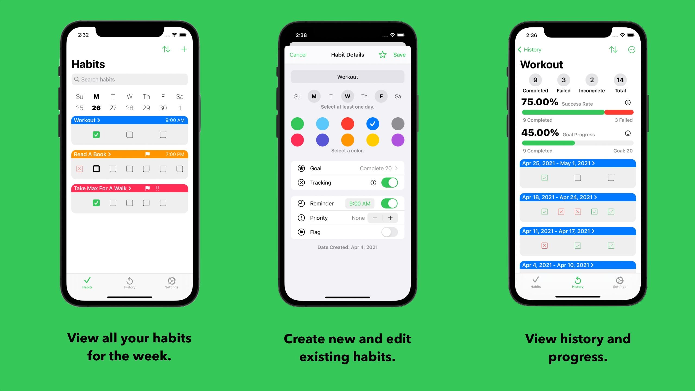
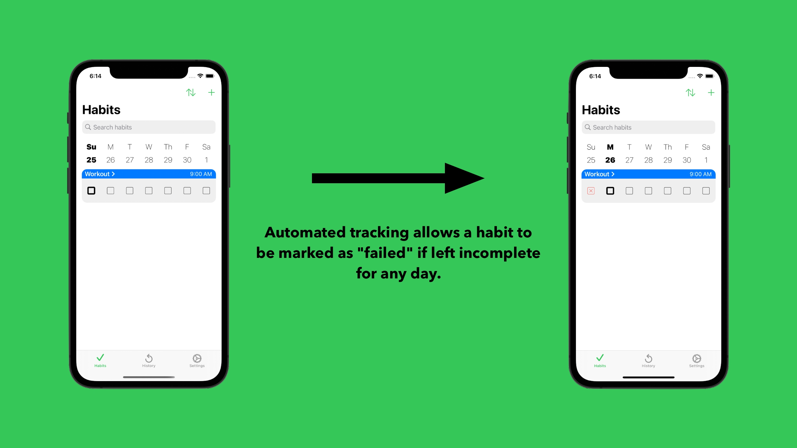
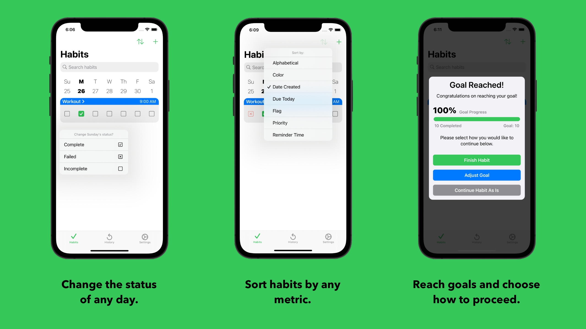
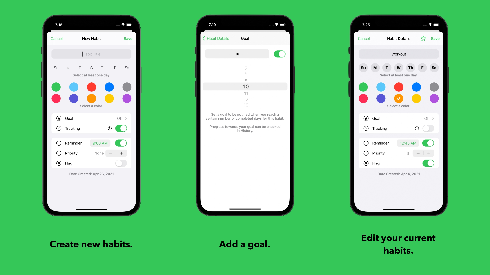
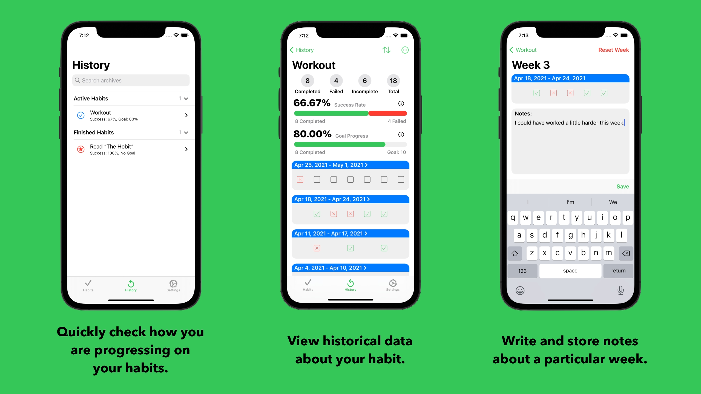
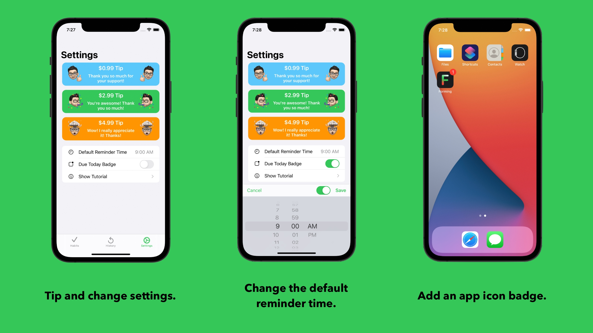

# Forming: iPhone Habit Tracking App
**Forming** is an iPhone application designed to allow users to create and view their habits on a weekly basis, view their history and track goals, and hold users accountable with automated tracking. It is designed to allow the user to quickly identify which habits need to completed for the current day. 

Forming was designed, built, and tested using Swift and programatic UI in Xcode.

### Technologies Used
- Core Data
- Background App Refresh
- Notification Center
- UIKit
 

## Features and Functions

- Forming was designed to view all of your habits that you want to complete on a weekly basis. You can see what you did for the week, see what needs to be done today, and see what's coming up in the week.
- Habits can be created and edited. Habits can have a title, days of the week to be completed, an associated color, goal, whether or not to track, reminder, priority, and a flag.
- History, progress towards goals, and different statistics can be viewed for any habit.
 

- Automated habit tracking allows for the user to be held responsible for their habits. Let's say you have the habit "Workout" set to be completed on Monday, but it was left it incomplete, it will then be marked as "failed" the next day the app is opened. But the completion status can be changed for any day with a long press on that day's checkbox.
 

- Long pressing on any checkbox allows the user to select "complete", "failed", or "incomplete" for any particular day a habit is supposed to occur. This allows for flexibility with users' habits.
- Habits can be sorted by numerous metrics, including alphabetically, by color, chronological, if it's due today, by flag, by priority, and by reminder time.
- A habit goal is reached when the user completes a user-specified number of times they want to complete a habit. When that goal is reached, the user is notified and is asked how they want to proceed with their habit, including "Finishing" a habit.
 

- New habits can easily be created using the sliding input screen.
- Goals can be easily set for any habit.
- Habits are easily editable. Here, the user can "Finish" their habit at any time by tapping the star.
 

- In the "History" tab, the user can see their active habits and basic statistics, along with any "Finished" habits that were archived.
- Tapping on a row displays the historical details for that habit. This includes how many times a habit has been completed, failed, or left incomplete. "Success Rate" is a measure of how successful a user is at completing that habit. "Goal Progress" is a measure of the progress towards the user's goal for that habit.
- Tapping on a week displays a screen where the user can enter notes about that week, along with changing the completion status for any day.
 

- In the "Settings" screen, the user can tip the developer and can change various settings.
- The default reminder time for new habits can be changed.
- A badge can be added to the app icon to display how many habits are due today.